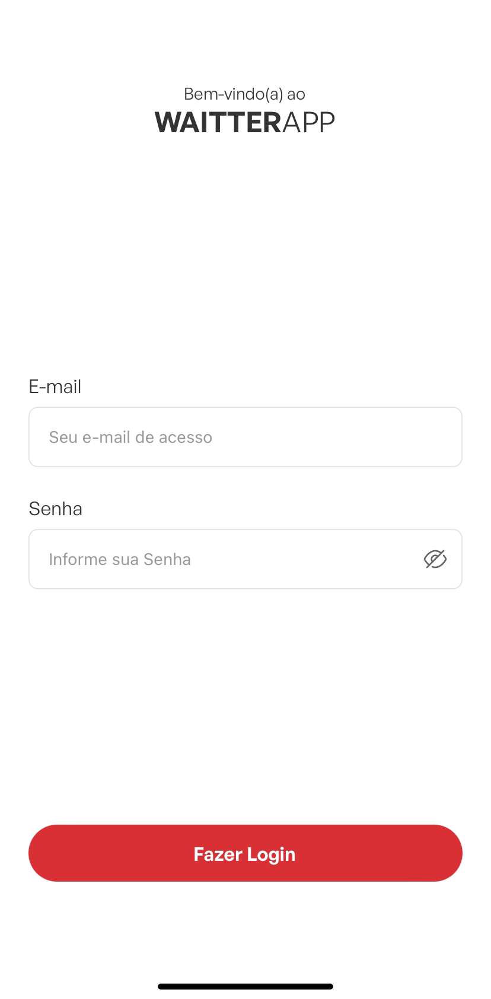
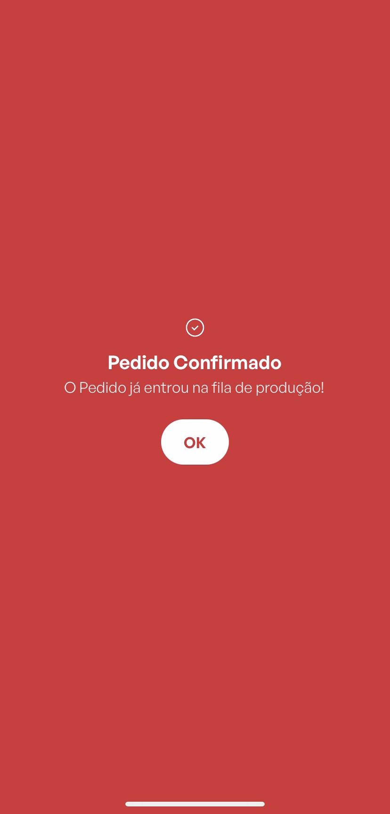

<h1 align="center">
    Waitter APP
</h1>

  <a href="#-tecnologias">Tecnologias</a>&nbsp;&nbsp;&nbsp;|&nbsp;&nbsp;&nbsp;
  <a href="#-projeto">Projeto</a>&nbsp;&nbsp;&nbsp;|&nbsp;&nbsp;&nbsp;

 

<h2 align="center">Login</h2>
  

 

<h2 align="center">Loading</h2>
  

 

<h2 align="center">Home 1.0</h2>
  

 

<h2 align="center">Home 2.0</h2>
  

 

<h2 align="center">Product Modal</h2>
  

 

<h2 align="center">Table Modal</h2>
  

 

<h2 align="center">Selected Table/Cart</h2>
  

 

<h2 align="center">Confirm Screen</h2>
  

 

<h2 align="center">1.0 Version video</h2>
  

 

<h2 align="center">2.0 Version video</h2>
  

 

## 🚀 Tecnologias
Esse projeto foi desenvolvido com as seguintes tecnologias:
- TypeScript
- React Native
- Styled-Components
- React Navigation
- Axios

## 💻 Projeto
Aplicativo para gerenciar os pedidos de um restaurante.
A primeira versão bem simples foi feita e agora estou atualizando para uma versão
mais completa com login, perfil entre outros.

## Como rodar na sua máquina
Use os seguintes comandos
- API: https://github.com/CaioChristhian/api-waiter-app
- Primeiro baixe as dependencias e rode a api, conectando em um banco MongoDB da sua maquina na porta 27017;
- No atual projeto rode yarn;
- E yarn start para executar o expo;
